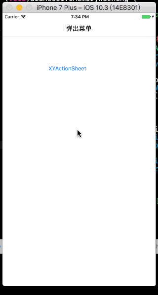

[](https://developer.apple.com/iphone/index.action)
[](https://developer.apple.com/documentation/)

[](http://www.jianshu.com/u/eec143f2560d)

## XYActionSheet
简易可自定义ActionSheet菜单 

**Email : firehsia1204@gmail.com**

**欢迎Issue 欢迎邮件 欢迎Star** 



## 版本记录
1.0.0 --- 初始版本 简单实现ActionSheet

## Installation

1. OC版本 
 
		直接将XYActionSheet文件夹下OC文件添加到工程
	
	Swift版本
	
		直接将XYSideViewController文件夹下Swift文件添加到工程
 
## OC版本
直接初始化调用
 
 ```
 // 定义菜单数组
 NSArray *titles = @[@"拍摄", @"从手机相册选择"];
 [[XYActionSheet actionSheet] showActionSheetWithTitles:titles selectedIndexBlock:^(NSInteger index) { 
  // index 对应 title数组的下标 	
  // index == title.count 为取消操作
 }
 ```
 
## Swift版本
coding 
 
